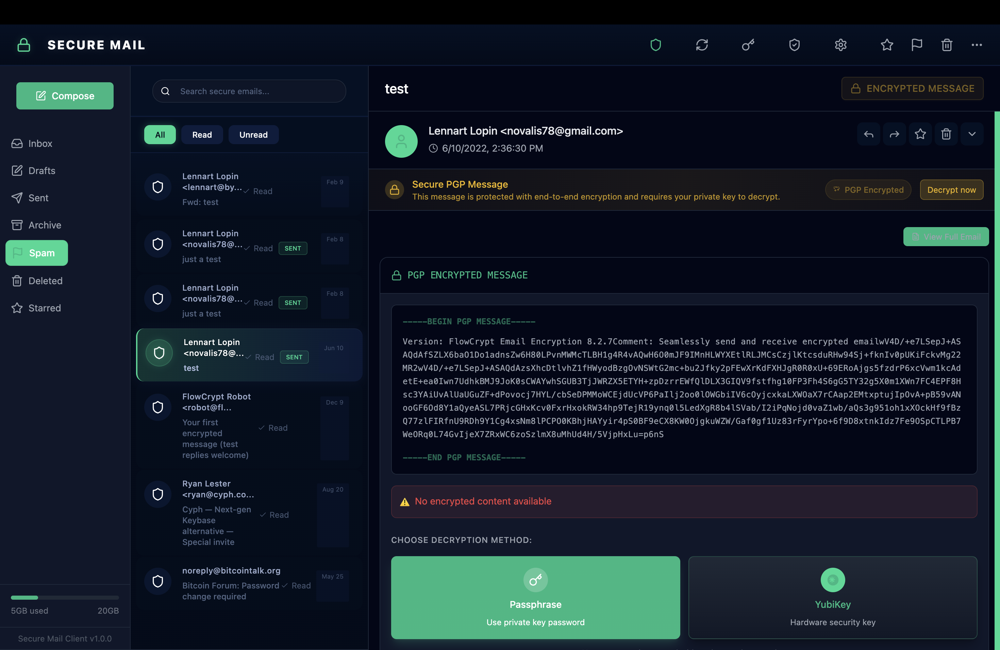

# Secure Mail Client



Secure Mail Client is a high-security email application that ensures privacy and confidentiality for your communications. It leverages PGP (Pretty Good Privacy) encryption to provide end-to-end encryption for all your messages. Connect it to your Gmail account or other IMAP server, and it will focus on PGP encrypted emails ONLY, ignoring the rest - making SMC the perfect choice for everyone who values digital privacy.

---

## Features

### Core Security Features
- **PGP Encryption:** Automatically encrypts and decrypts email messages using PGP keys
- **YubiKey Integration:** Hardware security module support for enhanced protection
- **Tiered Security Model:** Works with or without hardware keys, adapting security level dynamically
- **Zero Plain-Text Storage:** All credentials and sensitive data are always encrypted at rest

### Email Security
- **Intelligent PGP Detection:** Automatically identifies encrypted emails in any mailbox
- **Secure Inbox:** Stores all emails in an encrypted format to prevent unauthorized access
- **Visual Security Indicators:** Clear visual feedback on encryption status of all messages
- **Real-time Decryption Progress:** Visual feedback during message decryption operations

### User Experience
- **Modern Three-Panel Layout:** Intuitive navigation with folders, message list, and content views
- **Read/Unread Message Filters:** Easily sort your inbox based on message status
- **Dark Theme Security Focus:** Clean interface with security-oriented visual design 
- **Responsive Design:** Adapts to different screen sizes and device types
- **Multiple Decryption Methods:** Choose between passphrase or YubiKey decryption with a user-friendly interface
- **Content Visualization:** Clearly formatted PGP message display with syntax highlighting

### Recent Updates
- **Improved UI Design:** Enhanced contrast and visual appeal across the application
- **Streamlined Startup:** Removed automatic settings dialog on startup for better user experience
- **Frameless Window:** Modern, clean appearance without the standard Electron toolbar
- **Fixed Email Body Display:** Ensures all email content is properly displayed in the detail view
- **Enhanced YubiKey Integration:** Complete redesign of YubiKey settings with modern tabbed interface
- **Full-Width Settings:** Improved Key Management and YubiKey settings panels for better information display

---

## Screenshots and Features

### Secure Email Display
The application provides a beautiful, security-focused interface for viewing encrypted emails with clear PGP message formatting and decryption options.

### Key Management
The Key Management interface allows you to generate, import, and manage your PGP keys with a user-friendly design.

### YubiKey Integration
The YubiKey settings provide a modern, tabbed interface for managing hardware security keys with Status, Setup, and Info sections.

### Security Status Indicators
Visual indicators throughout the application provide clear feedback on the encryption status of messages and current security level.

---

## Installation

1. Clone the repository:
   ```bash
   git clone https://github.com/novalis78/secure-mail-client.git
   ```
2. Navigate to the project directory:
   ```bash
   cd secure-mail-client
   ```
3. Install dependencies:
   ```bash
   npm install
   ```
4. Run the application:
   ```bash
   npm run dev
   ```

---

## Security Architecture

Secure Mail Client implements a multi-layered security approach:

### Credential Protection System
- **Environment Variables:** Basic credentials can be stored in `.env` files for convenience
- **Machine-Derived Keys:** Without YubiKey, generates a machine-specific encryption key
- **YubiKey Integration:** When detected, the system automatically upgrades security:
  - Derives a stronger encryption key from the YubiKey
  - Re-encrypts all credentials with this hardware-derived key
  - Enables hardware-based decryption operations
  - Provides visual status indicators for active hardware security

### Adaptive Security
- **Auto-Detection:** Automatically detects when a YubiKey is connected or removed
- **Seamless Fallback:** Gracefully reverts to software-based encryption when hardware is unavailable
- **Security Level Indicators:** Clear visual feedback about current security level
- **Zero Plain-Text:** At no point are credentials or private keys stored in plain text

## Usage

1. **Initial Setup:**
   - Set up your PGP keys by importing existing keys or generating new ones
   - Connect to your Gmail or other IMAP provider
   - Optionally connect a YubiKey for enhanced security

2. **Daily Operations:**
   - **View Secure Messages:** Application automatically detects and filters encrypted emails
   - **Decrypt Messages:** Use your YubiKey or passphrase to decrypt messages
   - **Compose Encrypted Emails:** Write secure emails with automatic PGP encryption
   - **Manage Inbox:** Use filters and categories like drafts, sent, archived, and starred

---

## Contributing

Contributions are welcome! Please follow these steps:

1. Fork the repository.
2. Create a feature branch:
   ```bash
   git checkout -b feature-name
   ```
3. Commit your changes:
   ```bash
   git commit -m "Add a feature"
   ```
4. Push your branch:
   ```bash
   git push origin feature-name
   ```
5. Submit a pull request.

---

## License

This project is licensed under the MIT License. See the `LICENSE` file for more details.

---

## Support

If you encounter any issues or have questions, please open an issue on GitHub or contact support at [support@securemailclient.com](mailto:support@securemailclient.com).

---

## Acknowledgments

- **PGP Encryption Library:** Thanks to the open-source community for providing robust encryption tools.
- **UI/UX Design:** Special thanks to our design team for the intuitive user interface.

